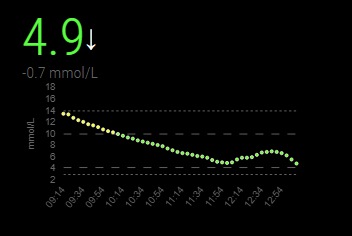
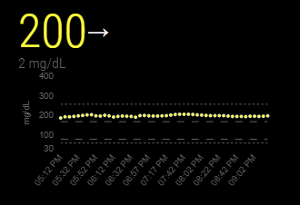
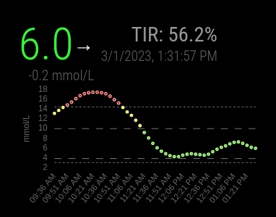
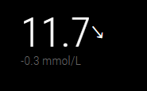
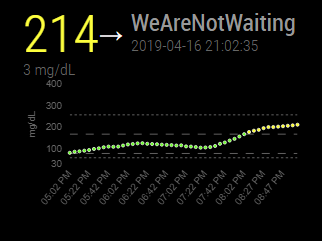
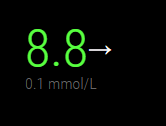

# MMM-Nightscout
[Magic Mirror](https://magicmirror.builders/) Module - Keep track of blood glucose levels with ease thru your magic mirror. Display real time blood glucose levels, with trends and warnings. Powered by [Nightscout](http://www.nightscout.info/)

## Prerequisites and requirments
1. You need to have Nightscout enabled CGM 
2. You need to setup your own Nightscout website, please follow this [tutorial](http://www.nightscout.info/wiki/welcome)

## Install
1. Clone repository into ``../modules/`` inside your MagicMirror folder.
2. Run ``npm install`` inside ``../modules/MMM-Nightscout/`` folder
3. Add the module to the MagicMirror config

## Update
1. Run ``git pull`` inside ``../modules/MMM-Nightscout/`` folder.
2. Run ``npm install`` inside ``../modules/MMM-Nightscout/`` folder

## Configuration
MMM-Nighscout works with any public hosted Nightscout instance. Important is to verify that your instance is accessible over the public internet by visiting http(s)://YOURSITE (Example Azure: https://YOURSITENAMEHERE.azurewebsites.net or Heroku: https://YOURSITENAMEHERE.herokuapp.com). Please also verify that your site is showing your data as well before proceeding.


It is possible to use tokens for authenticating as well. The following is needed to set it up:
1. Create a role with "api:*:read" as permissions.
2. Create a subject and set it to use the role created in step 1.
3. Copy the "Access token" from step 2 and paste into the config.js file in the "token" field.
```
modules: [
    ...
    {
        module: "MMM-Nightscout",
            position: "top_left",
            config: {
                debug: true, //Optional: set to true if you want debug logs
                baseUrl: 'https://YOURSITENAMEHERE.azurewebsites.net', //Required: Base url to your Nightscout webapplication. Please make sure to not have any traling /
                colorEnabled: true, //Optional: set to true if you want to get colorful bs values. Default is false.
                chartWidth: 350,  //Optional: set chart width in px. Default is 350px.
                chartHours: 4, //Optional: number of hours that chart tracks. Default is 4. 
                renderChart: true,  //Optional: set to false if you dont want to get a chart. Default is true.
                token: false, //Optional: use a token to authenticate against the Nightscout server.
                showTIR: false, //Optional: set to true if you want to display TIR for the last <chartHours> number of hours.
                extendedHeader: false //Option: set to false if you want to hide server title and last glucose value.
        }
    },
    ...
]
```

## Chart
Nightscout similar chart that has fully configurable dimensions. Support for color coding and possibility of tracking up to 24hrs of data.





Time in range calculation for displayed chart.



## Configs retrieved from Nightscout
Supports both mmol/L and mg/dL

mmol/L



mg/dL



## Color theme
Set colorEnabled = true to render blood glucose level based on Nightscout thresholds (critical, warning, normal). Default is false. 




## Screenshot


